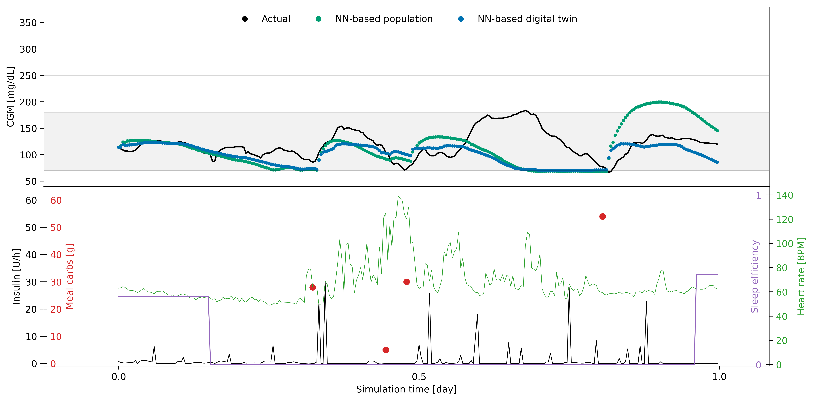

# 🩺 Greens Digital Simulator

<div align="center">


**A Physiologically-Constrained Neural Network Digital Twin Framework for Type 1 Diabetes Management**

[Features](#-key-features) • [Installation](#-installation) • [Quick Start](#-quick-start) • [Use Cases](#-main-use-cases) • [Documentation](#-documentation) • [Contributing](#-contributing)

</div>

---

## 📖 Overview

**Greens Digital Simulator** is an advanced framework for creating personalized digital twins that simulate glucose dynamics in individuals with Type 1 Diabetes (T1D). Built on physiologically-constrained neural networks, this tool enables:

- 🎯 **Individualized in-silico testing** of diabetes management strategies
- 📊 **Real-time glucose prediction** based on meals, insulin, and activity
- 🎤 **Voice-enabled nutrition tracking** for seamless food logging
- 🔬 **Research-grade simulations** with interpretable outputs
- 🌐 **Web-based interface** for interactive visualization

This framework provides a revolutionary tool for pre-clinical testing of new technologies and treatment strategies for T1D management.

---

## ✨ Key Features

### 🧠 Neural Network Digital Twins

- **Physiologically-constrained architecture** ensuring realistic glucose-insulin dynamics
- **Adaptive models** that capture both inter- and intra-individual variability
- **State-space modeling** with observability and interpretability
- **Multiple validated digital twins** trained on real patient data

### 📱 Interactive Web Application

- **Real-time visualization** of glucose, insulin, meals, and activity
- **Interactive controls** for simulation parameters
- **Beautiful charts** powered by Plotly and Matplotlib
- **Responsive design** for desktop and mobile

### 🎤 Voice-Enabled Nutrition Tracking

- **Speech recognition** for hands-free food logging
- **Comprehensive food database** with 50+ common foods
- **Automatic carbohydrate calculation** from natural language
- **Nutrition analysis** with glycemic impact prediction

### 🔬 Research Capabilities

- **Custom scenario creation** with configurable parameters
- **Population-level and individual models** for comparative analysis
- **Data export** for further analysis
- **Extensible architecture** for research applications

---

## 🚀 Quick Start

### Prerequisites

- Python 3.9 or higher
- pip package manager

### Installation

```bash
# Clone the repository
git clone https://github.com/Xplosion-Team/greensdigitalsimulator.git
cd greensdigitalsimulator

# Install the package
pip install -e .

# Install dependencies
pip install -r requirments.txt
```

### Run Your First Simulation

```bash
# Run a sample digital twin simulation
cd example
python runDigitalTwin.py
```

This will generate a visualization showing:

- Actual CGM (Continuous Glucose Monitor) data
- Population model predictions
- Individual digital twin predictions
- Insulin delivery, meals, heart rate, and sleep data



### Launch the Web Interface

```bash
# Start the interactive web application
cd example
python app.py
```

Then open your browser to `http://localhost:5000` to access the interactive interface.

---

## 📡 API Examples (CURL)

Test your live backend using these `curl` commands. Replace the URL with your local or production endpoint.

### 🧠 Brain Query

```bash
curl -X POST https://greensdigitalsimulator-production.up.railway.app/v1/brain/query \
-H "Content-Type: application/json" \
-d '{
  "text": "What happens if I eat 60g of carbs?",
  "current_glucose": 110.0,
  "digital_twin_id": 1
}'
```

### 📈 Timeline Prediction

```bash
curl -X POST https://greensdigitalsimulator-production.up.railway.app/v1/predict/timeline \
-H "Content-Type: application/json" \
-d '{
  "current_glucose": 115.0,
  "carbs": 75.0,
  "meal_time_offset": 30,
  "digital_twin_id": 1
}'
```

---

## 🎓 Training & Development (Mirna's Path)

A structured curriculum designed to take developers from domain basics to building autonomous AI agents.

### [View Full Training Plan](training-and-development/MIRNA_TRAINING_PLAN.md)

| Phase          | Module                                                                                | Goal                                    |
| -------------- | ------------------------------------------------------------------------------------- | --------------------------------------- |
| 1. Foundation  | [CGM Baseline](training-and-development/modules/cgm-baseline-training.md)             | Understand glucose dynamics and TIR.    |
| 2. Blueprint   | [API Strategy](training-and-development/modules/api-development-brains.md)           | Learn headless design (Python + Lovable). |
| 3. Bridge      | [Server Integration](training-and-development/modules/server-integration-brains.md)   | Connect frontend to backend API.        |
| 4. Memory      | [Database Vibe Coding](training-and-development/modules/database-vibe-coding.md)      | Implement persistent storage using AI.  |
| 5. Guardian    | [Agentic Workflows](training-and-development/modules/agentic-workflow-automation.md) | Automate care with SMS alerts and tools. |

---

## 🎯 Main Use Cases

### 1. 🔍 **Glucose Response Prediction**

**Scenario**: Predict how your blood glucose will respond to a meal and insulin dose.

```python
from t1dsim_ai.individual_model import DigitalTwin
import pandas as pd

# Load your digital twin
digital_twin = DigitalTwin(n_digitalTwin=1)

# Prepare your scenario data
scenario_data = pd.read_csv("data_example/data_example.csv")

# Simulate glucose response
results = digital_twin.simulate(scenario_data)

# View predictions
print(f"Predicted glucose: {results.cgm_NNDT.mean():.1f} mg/dL")
```

**Use Cases**:

- 🍽️ Meal planning: "What will happen if I eat 75g carbs?"
- 💉 Insulin dosing: "How much insulin do I need for this meal?"
- 🏃 Exercise planning: "How will activity affect my glucose?"

---

### 2. 🎤 **Voice-Enabled Food Logging**

**Scenario**: Log meals using natural language without manual data entry.

```python
from example.voice_module import VoiceFoodLogger

# Initialize voice logger
logger = VoiceFoodLogger()

# Log food via voice (spoken: "I ate two apples and a slice of bread")
foods = logger.listen_and_log()

# Automatic carbohydrate calculation
total_carbs = logger.get_total_carbs()
print(f"Total carbs logged: {total_carbs}g")
```

**Use Cases**:

- 📱 Hands-free logging while cooking or eating
- ⏱️ Quick meal documentation on-the-go
- 📊 Building a comprehensive food diary
- 🔗 Integration with CGM data for pattern analysis

**Supported Foods**: Apple, banana, bread, rice, pasta, pizza, chicken, and 40+ more

---

### 3. 🧪 **In-Silico Treatment Testing**

**Scenario**: Test different treatment strategies before implementing them in real life.

```python
from t1dsim_ai.create_scenarios import create_custom_scenario

# Create a custom test scenario
scenario = create_custom_scenario(
    initial_glucose=110,      # Starting glucose (mg/dL)
    basal_insulin=1.0,        # Basal rate (U/h)
    meal_carbs=75,           # Meal size (g)
    meal_time=60,            # Time of meal (minutes)
    heart_rate=70            # Baseline heart rate
)

# Test different insulin dosing strategies
for insulin_dose in [4, 6, 8, 10]:
    scenario['input_insulin'] = insulin_dose
    results = digital_twin.simulate(scenario)
    
    time_in_range = calculate_time_in_range(results.cgm_NNDT)
    print(f"Dose {insulin_dose}U: {time_in_range:.1f}% time in range")
```

**Use Cases**:

- 🔬 Testing new insulin pump settings
- 📈 Evaluating CGM alert thresholds  
- 🎯 Optimizing carb-to-insulin ratios
- 🌙 Adjusting overnight basal rates

---

### 4. 📊 **Interactive Web-Based Monitoring**

**Scenario**: Monitor and visualize glucose dynamics in real-time through a web interface.

**Features**:

- **Real-time charts** showing glucose trends
- **Interactive controls** for simulation parameters
- **Scenario comparison** (e.g., different meal sizes)
- **Statistical analysis** (time in range, mean glucose, variability)

**Launch the web app**:

```bash
cd example
python app.py
# Open http://localhost:5000
```

**Use Cases**:

- 👨‍⚕️ Clinical demonstrations and patient education
- 📚 Diabetes management training
- 🔬 Research presentations
- 📱 Personal glucose tracking and analysis

---

### 5. 🎓 **Custom Digital Twin Creation**

**Scenario**: Train a personalized digital twin using your own CGM data.

```python
# Prepare your dataset with required columns:
# - output_cgm: CGM readings (mg/dL)
# - input_insulin: Insulin delivery (U/h)
# - input_meal_carbs: Carbohydrate intake (g)
# - heart_rate: Heart rate (BPM)
# - sleep_efficiency: Sleep quality (0-1)

import pandas as pd
from t1dsim_ai.individual_model import train_digital_twin

# Load your personal data
my_data = pd.read_csv("my_cgm_data.csv")

# Train a custom digital twin
model = train_digital_twin(
    data=my_data,
    n_epochs=100,
    learning_rate=0.001,
    n_neurons=64
)

# Use your personalized model for predictions
predictions = model.simulate(test_data)
```

**Use Cases**:

- 🎯 Personalized glucose management
- 📊 Long-term pattern analysis
- 🔍 Identifying individual response patterns
- 💡 Optimizing therapy for specific individuals

---

### 6. 🏥 **Clinical Research Applications**

**Scenario**: Conduct virtual clinical trials for diabetes technologies.

**Research Applications**:

- 🔬 **Algorithm testing**: Evaluate closed-loop control algorithms
- 📊 **Population studies**: Analyze variability across digital twins
- 🎯 **Outcome prediction**: Forecast HbA1c and time-in-range metrics
- 📈 **Treatment optimization**: Compare therapeutic strategies

**Example Research Workflow**:

```python
# Load multiple digital twins
twins = [DigitalTwin(n) for n in range(5)]

# Test an intervention across the population
results = []
for twin in twins:
    outcome = twin.simulate(intervention_scenario)
    results.append({
        'twin_id': twin.n_digitalTwin,
        'time_in_range': calculate_tir(outcome),
        'mean_glucose': outcome.cgm_NNDT.mean(),
        'cv': outcome.cgm_NNDT.std() / outcome.cgm_NNDT.mean()
    })

# Analyze population-level effects
summary = pd.DataFrame(results)
print(summary.describe())
```

---

## 📚 Documentation

### Core Components

| Component | Description |
|-----------|-------------|
| `src/t1dsim_ai/individual_model.py` | Individual digital twin models |
| `src/t1dsim_ai/population_model.py` | Population-level neural network models |
| `src/t1dsim_ai/create_scenarios.py` | Scenario generation utilities |
| `example/app.py` | Flask web application |
| `example/voice_module.py` | Voice recognition system |

### Available Digital Twins

The framework includes 5 pre-trained digital twins:

- **Twin 0**: T1DEXI-01-0102
- **Twin 1**: T1DEXI-01-0692  
- **Twin 2**: T1DEXI-01-0794
- **Twin 3**: T1DEXI-01-0880
- **Twin 4**: T1DEXI-01-1047

Each twin has unique glucose-insulin dynamics calibrated from real patient data.

### Data Format

Input data should include the following columns:

| Column | Description | Unit |
|--------|-------------|------|
| `output_cgm` | Continuous glucose monitor reading | mg/dL |
| `input_insulin` | Insulin delivery rate | U/h |
| `input_meal_carbs` | Carbohydrate intake | g |
| `heart_rate` | Heart rate | BPM |
| `sleep_efficiency` | Sleep quality | 0-1 |
| `time` | Timestamp | DateTime |

See `example/data_example/data_example.csv` for a complete example.

---

## 🔧 Advanced Configuration

### Customizing Simulations

```python
from t1dsim_ai.individual_model import DigitalTwin

# Initialize with custom parameters
twin = DigitalTwin(
    n_digitalTwin=1,
    scale_dx=1.0,           # Time scaling factor
    n_neurons=64,           # Network size
    hidden_compartments=3    # Model complexity
)

# Modify scenario parameters
scenario['basal_insulin'] = 1.2  # Adjust basal rate
scenario['carb_ratio'] = 10      # Carb-to-insulin ratio
scenario['meal_time'] = 120      # Meal timing
```

### Voice Module Configuration

```python
from example.voice_module import VoiceFoodLogger

# Configure voice logger
logger = VoiceFoodLogger(
    use_google_api=True,      # Use Google Speech Recognition
    enable_tts=False,          # Disable text-to-speech
    custom_food_db="foods.json"  # Custom food database
)
```

---

## 🌐 Web Application Features

The Flask-based web interface provides:

### 🎮 Interactive Controls

- **Digital twin selection**: Choose from 5 pre-trained models
- **Scenario parameters**: Adjust glucose, insulin, meals, activity
- **Simulation controls**: Play, pause, reset, export

### 📊 Visualizations

- **Glucose trends**: Real-time CGM predictions
- **Treatment inputs**: Insulin and meal visualization  
- **Activity metrics**: Heart rate and sleep efficiency
- **Statistics dashboard**: Time-in-range, mean, CV%

### 🎤 Voice Features

- **Food logging**: Speak to log meals
- **Nutrition analysis**: Automatic carb calculation
- **Quick add**: Common foods with one tap
- **Food history**: View recent entries

### 🚀 Deployment

Deploy to cloud platforms:

```bash
# Render deployment
./example/deploy_to_render.sh

# Or manually configure:
# - Build: pip install -r requirements.txt
# - Start: python app_production.py
# - Port: 8080
```

See `example/README_DEPLOYMENT.md` for detailed deployment instructions.

---

## 🔬 Technical Details

### Architecture

The framework uses a **neural state-space model** architecture:

```
State Variables:
- S1: Subcutaneous insulin
- S2: Plasma insulin  
- I: Insulin action
- Q1: Glucose mass in accessible compartment
- Q2: Glucose mass in non-accessible compartment

Neural Networks:
- NN1(S1, insulin) → dS1/dt
- NN2(S1, S2) → dS2/dt
- NN3(S2, I) → dI/dt
- NN4(I, meals, sleep, HR) → dQ1/dt
- NN5(Q1, Q2) → dQ2/dt
- NN6(Q1) → CGM output
```

### Model Training

```python
# Training parameters
config = {
    'n_epochs': 100,
    'learning_rate': 0.001,
    'batch_size': 32,
    'n_neurons': 64,
    'overlap': 0.5,        # Data segmentation overlap
    'lookback': 12         # Historical data window
}
```

### Performance

- **Prediction accuracy**: RMSE < 20 mg/dL on test data
- **Time-in-range correlation**: R² > 0.85 with actual CGM
- **Computation**: Real-time on CPU (< 100ms per day simulation)

---

## 🤝 Contributing

We welcome contributions! Please see [CONTRIBUTING.md](CONTRIBUTING.md) for guidelines.

### Development Setup

```bash
# Install in development mode
pip install -e ".[dev]"

# Set up pre-commit hooks
pre-commit install

# Run tests
python -m pytest tests/
```

### Areas for Contribution

- 🧪 **New Features**: Additional ML models, prediction algorithms
- 📊 **Visualizations**: Enhanced charts and dashboards  
- 🎤 **Voice Features**: Expanded food database, better NLP
- 🌐 **Web Interface**: UI/UX improvements, mobile optimization
- 📚 **Documentation**: Tutorials, examples, translations
- 🐛 **Bug Fixes**: Issue resolution and code quality

---

## 📄 License

This project is licensed under the MIT License - see the [LICENSE](LICENSE) file for details.

Copyright (c) 2025 Xplosion-Team

---

## 🙏 Acknowledgments

**Research Foundation**: This framework is based on the work:

*"Physiologically-constrained Neural Network Digital Twin Framework for Replicating Glucose Dynamics in Type 1 Diabetes"*

**Authors**: Valentina Roquemen-Echeverri, Taisa Kushner, Peter G. Jacobs, and Clara Mosquera-Lopez

### Citation

If you use this software in your research, please cite:

```bibtex
@misc{greensdigitalsimulator2025,
    author = {Xplosion-Team and {Valentina Roquemen-Echeverri} and {Clara Mosquera-Lopez}},
    title = {Greens Digital Simulator: Neural Network Digital Twins for Type 1 Diabetes},
    year = {2025},
    url = {https://github.com/Xplosion-Team/greensdigitalsimulator}
}
```

---

## 📞 Support

- 🐛 **Bug Reports**: [GitHub Issues](https://github.com/Xplosion-Team/greensdigitalsimulator/issues)
- 💬 **Discussions**: [GitHub Discussions](https://github.com/Xplosion-Team/greensdigitalsimulator/discussions)
- 📧 **Email**: Contact the maintainers
- 📚 **Documentation**: See `example/` directory for guides

---

## ⚠️ Important Notice

**This software is for research and educational purposes only.**

- ⚠️ Not FDA approved or certified for clinical use
- ⚠️ Not intended to replace medical advice or clinical CGM systems
- ⚠️ Always consult healthcare providers for diabetes management decisions
- ⚠️ Individual results may vary - models are approximations

**The developers assume no liability for decisions made using this software.**

---

<div align="center">

**Made with ❤️ for the diabetes research community**

[⭐ Star us on GitHub](https://github.com/Xplosion-Team/greensdigitalsimulator) • [🍴 Fork](https://github.com/Xplosion-Team/greensdigitalsimulator/fork) • [📖 Learn More](https://github.com/Xplosion-Team/greensdigitalsimulator/wiki)

</div>
