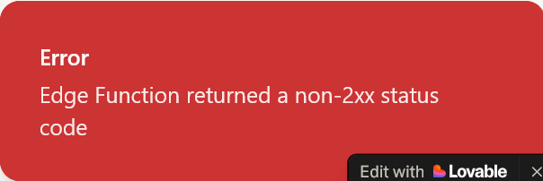
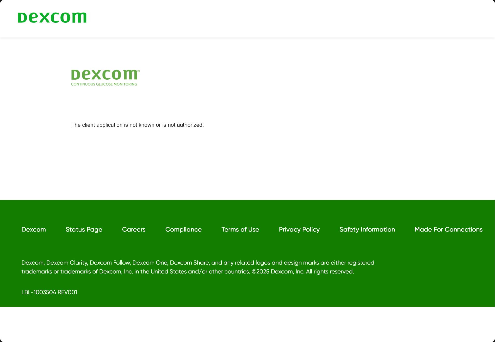
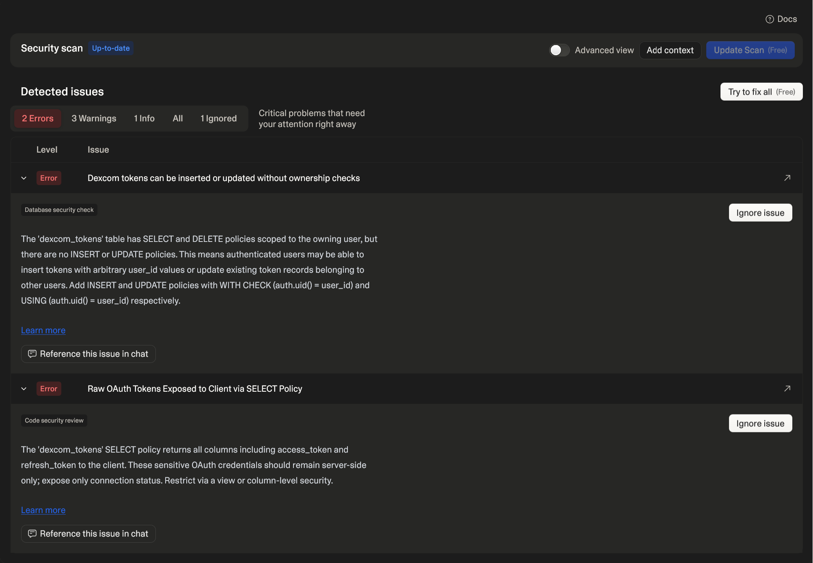
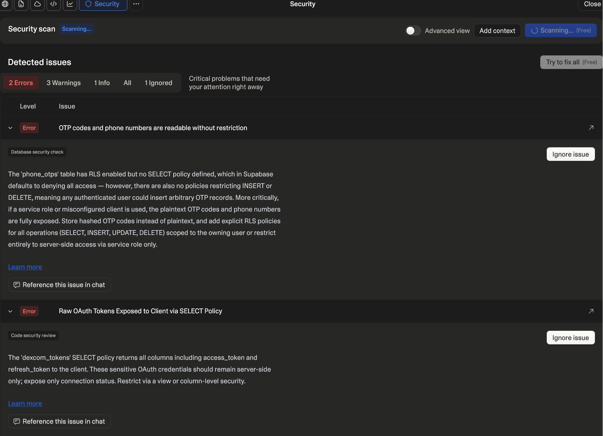

# Lovable Integration Testing

**Priority:** High

## — WHAT TO REVIEW (CURRENT LIVE SITE) —

- [x] **Landing page loads correctly** — ✅ Verified and working
- [x] **Headline and copy** are accurate and on-brand — ✅ Verified and working
- [x] **Buttons and CTAs** work as expected — ✅ Verified and working
- [x] **Mobile responsiveness** — test on a phone screen size — ✅ Verified and working
- [x] **Console errors** — open browser DevTools → Console tab, log any red errors — 3 issues logged (Issue #3)
- [x] **Load speed** — flag anything that feels slow — ✅ Verified and working
- [x] **Lovable edit badge** — confirm it is not visible to end users — ✅ Verified and working

---

## — WHAT IS NOT YET BUILT (FOR AWARENESS) —

The following tabs are in the development queue and do not exist yet. **Do not flag these as bugs — they are upcoming dev sprints.**

*   Journey tab
*   Circles tab
*   Games tab
*   Learn tab

---

## Logging Issues

When logging issues please include the following details:

*   **Section** where the issue appears
*   **Expected vs. Actual:** What you expected vs. what happened
*   **Screenshot** if possible

---

## Logged Issues

### Issue 1: Phone Number Login Error

*   **Section**: Login / Authentication
*   **Expected vs. Actual**: Expected to be able to submit phone number and proceed with login; instead, an error message is displayed preventing access.
*   **Lovable Explanation**: 
    > **Twilio Error 21608:** Your Twilio account is on a trial plan, which can only send SMS to phone numbers you've manually verified in the Twilio console.
    > 
    > **To fix this, either:**
    > 1. Verify the phone number at `twilio.com/console/phone-numbers/verified`
    > 2. Upgrade your Twilio account to a paid plan to send to any number
    > 
    > *(This is a Twilio account limitation, not a code issue.)*
*   **Screenshot**:
    

### Issue 2: Dexcom Connection Error

*   **Section**: Continuous Glucose Monitor (CGM) Integration / Dexcom
*   **Expected vs. Actual**: Expected to successfully establish a connection to Dexcom to pull glucose data; instead, an error is encountered preventing the connection.
*   **Lovable Explanation**: 
    > **Error:** *"The client application is not known or is not authorized"*
    > 
    > This means Dexcom doesn't recognize the `client_id` or the redirect URI doesn't match what's registered in the Dexcom developer portal. The app is sending `redirect_uri=https://2748ce3a-...lovableproject.com/dexcom/callback` (preview URL), but your Dexcom app is configured with `https://calm-glucose-guide.lovable.app/dexcom/callback`.
    > 
    > **To fix this, either:**
    > 1. Go to the Dexcom Developer Portal and add the preview URL as an additional redirect URI: 
    >    `https://2748ce3a-7ec0-4b84-b32c-cfef41e38ac5.lovableproject.com/dexcom/callback`
    > 2. Use your published app at `calm-glucose-guide.lovable.app` where the redirect URI already matches.
*   **Screenshot**:
    

### Issue 3: Developer Console Errors

*   **Section**: Global / Console
*   **Expected vs. Actual**: Expected a clean developer console without red errors; instead, errors are logged when loading the site.
*   **Resolution Status**: 
    > **Originally Fixed: 2 Issues**
    > - **OAuth tokens exposed to client:** Dropped the `SELECT`/`DELETE` policies on `dexcom_tokens` so raw tokens can never reach the browser. Client code now uses the `dexcom_connection_status` view which only exposes safe metadata columns.
    > - **Missing INSERT/UPDATE policies:** Marked as intentionally ignored since token management is handled server-side via edge functions with the service role key.
    > 
    > **Review of 2 "Remaining" Error-Level Issues:**
    > - **OTP codes readable without restriction:** The `phone_otps` table has RLS enabled with zero policies (deny-all mode). No client can read, insert, update, or delete. This is intentional because OTP verification happens entirely server-side via edge functions using the service role key. This was previously reviewed and ignored for the same reason.
    > - **Raw OAuth Tokens Exposed:** This was fixed earlier — the `SELECT` policy on `dexcom_tokens` was removed. The table now has zero client-side policies. Client code uses the `dexcom_connection_status` view which excludes sensitive token columns. The finding even has a `deleted_at` timestamp confirming it was resolved.
*   **Screenshot**:
    
    
