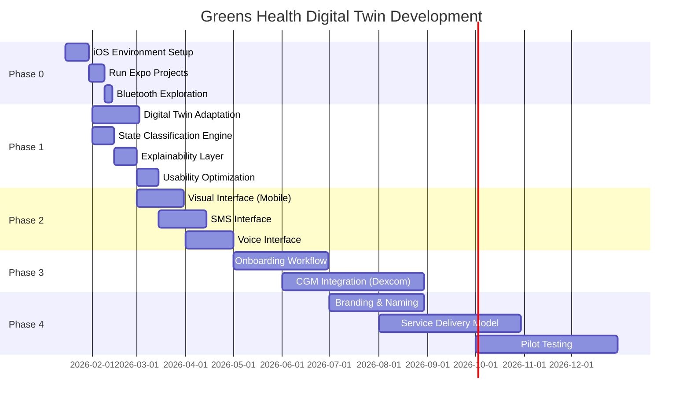
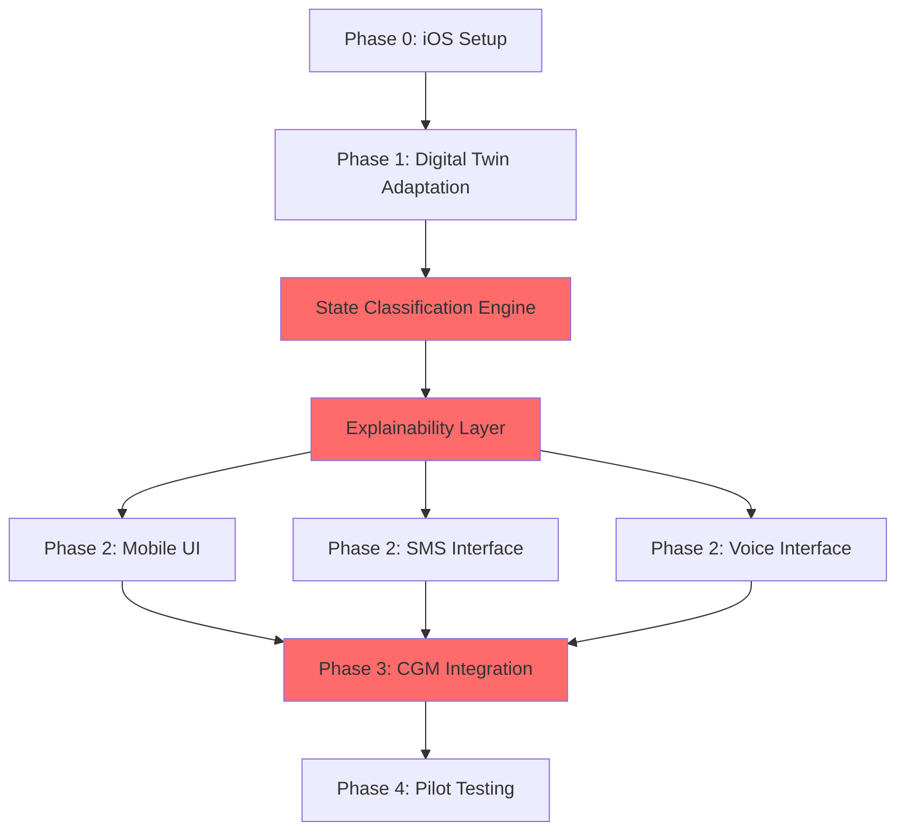

# Greens Health Digital Twin - Product Development Roadmap
## 18-Month Timeline (Jan 2026 - Jun 2027)

---

## 📊 Timeline Overview

---

## 🎯 Phase Breakdown

### **Phase 0: Foundation (Jan 15 - Feb 15, 2026)**
**Duration**: 30 days  
**Owner**: Mirna + Kehlin

#### Objectives
- ✅ Set up iOS development environment
- ✅ Run Expo projects successfully
- ✅ Explore Bluetooth capabilities (optional)
- ✅ Decide: iOS-only vs. web vs. both

#### Deliverables
- [ ] Expo app running on iOS simulator
- [ ] Bluetooth test project (if pursuing)
- [ ] Decision document: Platform strategy

#### Success Criteria
- Mirna can create and run Expo apps independently
- Team agrees on platform (iOS, web, or both)

---

### **Phase 1: Digital Twin Adaptation (Feb 1 - Mar 31, 2026)**
**Duration**: 60 days  
**Owner**: Kehlin + Dr. Mosquera + Mirna

#### Objectives
1. **Model Adaptation** (Weeks 1-2)
   - Adapt OHSU glucose-insulin model for mobile
   - Run Clara's model locally
   - Translate outputs to simplified states

2. **Explainability Layer** (Weeks 3-4)
   - Convert model outputs to plain language
   - Build message templates (patient, caregiver, clinician)
   - Integrate LLM for personalization

3. **Usability Optimization** (Weeks 5-6)
   - Design for older adults
   - Optimize for low digital literacy
   - Voice interface prototype

#### Deliverables
- [ ] State classification engine (`glucoseStates.ts`)
- [ ] Message template system (`messageTemplates.ts`)
- [ ] LLM integration (`llmPromptBuilder.ts`)
- [ ] Mobile interface prototype (one screen)
- [ ] Internal usability review report

#### Success Criteria
- Model outputs → human-readable states (100% coverage)
- Messages tested with 3+ seniors (comprehension >80%)
- Voice output working on iOS

#### Team Collaboration
- **Kehlin**: Define state thresholds, review messages
- **Dr. Mosquera**: Validate model accuracy, clinical guidance
- **Mirna**: Build TypeScript logic, mobile UI

---

### **Phase 2: Multichannel Interfaces (Mar 1 - May 31, 2026)**
**Duration**: 90 days  
**Owners**: Kehlin (Mobile), Daniel (SMS), Kehlin + Daniel (Voice)

#### 2.1 Visual Interface (Mobile App)
**Duration**: 30 days  
**Owner**: Kehlin + Mirna

- [ ] Intuitive charts for varying literacy levels
- [ ] Redesign UX/UI for aging populations
- [ ] Emphasis on trends over raw numbers
- [ ] Accessibility compliance (WCAG AAA)

**Deliverables**:
- [ ] 3-5 core screens (Status, History, Settings)
- [ ] High-contrast theme
- [ ] VoiceOver compatibility

#### 2.2 SMS Interface
**Duration**: 30 days  
**Owner**: Daniel (UMass)

- [ ] Simple SMS summaries of trends
- [ ] Regenerate digital twin recommendations as text
- [ ] Designed for users without smartphones

**Deliverables**:
- [ ] Twilio integration
- [ ] SMS message templates
- [ ] Two-way SMS commands ("STATUS", "HELP")

#### 2.3 Voice Interface
**Duration**: 30 days  
**Owner**: Kehlin (UMass collaboration)

- [ ] Audio-guided interactions for visually impaired
- [ ] Voice summaries of trends, reminders
- [ ] Integrate TTS/IVR API

**Deliverables**:
- [ ] Voice command system
- [ ] Phone line prototype (optional)
- [ ] Voice-only user flow

#### Success Criteria
- All 3 channels use same logic layer
- User can switch channels seamlessly
- SMS tested with 5+ users (no smartphone)

---

### **Phase 3: Onboarding & CGM Integration (May 1 - Aug 31, 2026)**
**Duration**: 120 days  
**Owners**: Kehlin (CGM), Daniel (Onboarding)

#### 3.1 User Onboarding & Support Workflow
**Duration**: 60 days

- [ ] Simplified authentication (OTP, no passwords)
- [ ] 15-60 min onboarding sessions (self-service + community-led)
- [ ] Education on device use, app navigation
- [ ] Triage & escalation to health navigators

**Deliverables**:
- [ ] Onboarding workflow document
- [ ] Escalation decision tree
- [ ] Training materials for navigators

#### 3.2 CGM Integration (Dexcom)
**Duration**: 90 days

- [ ] Secure API integration with Dexcom
- [ ] Data validation and synchronization
- [ ] Preparatory architecture for Libre sensors

**Deliverables**:
- [ ] Live Dexcom CGM data feed
- [ ] Modular sensor integration framework
- [ ] Data privacy compliance (HIPAA)

#### Success Criteria
- 90% of users complete onboarding in <30 min
- Real-time glucose data syncs every 5 min
- Zero data breaches

---

### **Phase 4: Branding & Service Model (Jul 1 - Dec 31, 2026)**
**Duration**: 180 days  
**Owner**: Daniel (UMass)

#### 4.1 Product Naming & Branding
**Duration**: 60 days

- [ ] Develop brand names (e.g., "Greens.ai GUIDE")
- [ ] Create accessible visual identity
- [ ] Friendly icons, warm tone

**Deliverables**:
- [ ] Final product name
- [ ] Branding style guide
- [ ] Marketing materials

#### 4.2 Service Delivery Model & Pitch
**Duration**: 90 days

- [ ] Define integrated service model (telehealth + digital twin)
- [ ] Highlight interdisciplinary care team
- [ ] Pitch deck for stakeholders

**Deliverables**:
- [ ] Service delivery model documentation
- [ ] Pitch deck (NIH/PCORI ready)
- [ ] Stakeholder-facing narrative

#### Success Criteria
- Brand tested with 10+ seniors (positive sentiment >80%)
- Service model approved by clinical partners
- Pitch deck ready for grant submission

---

### **Phase 5: Pilot Testing (Oct 1, 2026 - Jun 30, 2027)**
**Duration**: 270 days  
**Owner**: Full Team

#### Objectives
- [ ] Recruit 20-50 older adults with diabetes
- [ ] Deploy full system (app + SMS + voice + CGM)
- [ ] Collect usage data, feedback, clinical outcomes
- [ ] Iterate based on real-world use

#### Deliverables
- [ ] Pilot study protocol (IRB approved)
- [ ] Recruitment materials
- [ ] Data collection dashboard
- [ ] Final evaluation report

#### Success Criteria
- 80% user retention at 3 months
- 70% report improved glucose understanding
- 50% reduction in severe hypoglycemia events
- Clinical validation by Dr. Mosquera

---

## 🔗 Critical Path & Dependencies

**Critical Path** (Red):
1. State Classification Engine
2. Explainability Layer
3. CGM Integration

**Why Critical?**
- Everything depends on state classification
- Explainability is the core IP
- CGM integration is the "real data" milestone

---

## 👥 Team Responsibilities

| Phase | Kehlin | Mirna | Dr. Mosquera | Daniel |
|-------|--------|-------|--------------|--------|
| **Phase 0** | Setup guidance | Hands-on dev | - | - |
| **Phase 1** | State definitions | TypeScript logic | Model validation | - |
| **Phase 2** | Mobile UI | Mobile dev | - | SMS interface |
| **Phase 3** | CGM integration | API connection | Clinical review | Onboarding |
| **Phase 4** | Service model | - | Pilot design | Branding |
| **Phase 5** | Data analysis | Bug fixes | Clinical validation | User support |

---

## 📈 Milestones & Checkpoints

### **Month 1 (Feb 2026)**
- ✅ State classification engine working
- ✅ Mock data pipeline
- ✅ First mobile screen

### **Month 3 (Apr 2026)**
- ✅ Mobile app (3+ screens)
- ✅ SMS interface
- ✅ Voice output

### **Month 6 (Jul 2026)**
- ✅ Dexcom CGM integration
- ✅ Onboarding workflow
- ✅ Internal pilot (5 users)

### **Month 12 (Jan 2027)**
- ✅ Branding finalized
- ✅ Service model defined
- ✅ Pilot recruitment started

### **Month 18 (Jun 2027)**
- ✅ Pilot completed
- ✅ Clinical validation
- ✅ Grant submission ready

---

## 🚨 Risk Factors & Mitigation

| Risk | Probability | Impact | Mitigation |
|------|------------|--------|------------|
| **Dexcom API delays** | Medium | High | Start with mock data, build modular integration |
| **Senior adoption low** | Medium | High | Extensive onboarding, community partners |
| **LLM costs too high** | Low | Medium | Use templates first, LLM for edge cases only |
| **Mirna learning curve** | Low | Medium | Vibe coding with Antigravity, weekly check-ins |
| **Clinical validation fails** | Low | High | Dr. Mosquera involved from day 1 |
| **HIPAA compliance issues** | Medium | High | Legal review at Month 6, use compliant APIs |

---

## 💰 Budget Considerations (Rough Estimates)

| Item | Cost | Notes |
|------|------|-------|
| **LLM API** (GPT-4) | $500-1000/month | ~$0.004/message, 10k messages/month |
| **Dexcom API** | $0 (research use) | Confirm with Dexcom |
| **Twilio SMS** | $200-500/month | ~$0.01/SMS, 20k messages/month |
| **Expo/React Native** | $0 | Open source |
| **Cloud hosting** | $100-300/month | AWS/GCP for API server |
| **User testing** | $2000-5000 | Incentives for 20-50 participants |
| **Total (18 months)** | ~$30k-50k | Excluding salaries |

---

## 📊 Success Metrics (End of 18 Months)

### **Technical**
- [ ] 99.9% uptime for mobile app
- [ ] <5 second response time for predictions
- [ ] 100% WCAG AAA compliance

### **User Experience**
- [ ] 80% user retention at 3 months
- [ ] 70% report "easy to understand"
- [ ] 60% use voice features regularly

### **Clinical**
- [ ] 50% reduction in severe hypo events
- [ ] 30% improvement in time-in-range
- [ ] 80% user satisfaction (NPS >50)

### **Business**
- [ ] Grant submission ready (NIH/PCORI)
- [ ] 3+ clinical partners committed
- [ ] Service model validated

---

## 🎯 Next Immediate Actions (This Week)

### **Mirna**
1. [ ] Read training materials
2. [ ] Set up development environment
3. [ ] Start Week 1 tasks (state classification)

### **Kehlin**
1. [ ] Define glucose state thresholds with Dr. Mosquera
2. [ ] Review Mirna's Week 1 deliverables (Friday)
3. [ ] Draft example messages for each state

### **Team**
1. [ ] Weekly check-in scheduled (Fridays 2pm?)
2. [ ] GitHub repo organized
3. [ ] Decide: iOS-first or iOS + web

---

## 📚 Alignment with Grant Proposals

This roadmap maps directly to:

### **NIH/PCORI Specific Aims**
- **Aim 1**: Adapt digital twin for patient-facing use (Phase 1)
- **Aim 2**: Develop multichannel interfaces (Phase 2)
- **Aim 3**: Pilot test with older adults (Phase 5)

### **NSF Innovation Pathway**
- **Intellectual Merit**: Digital twin + LLM explainability (Phase 1)
- **Broader Impacts**: Equity through multichannel access (Phase 2-3)

---

## 🚀 The Bottom Line

**18 months from now**, you will have:

✅ A working glucose digital twin mobile app  
✅ SMS and voice interfaces for equity  
✅ Real-time CGM integration  
✅ Clinical validation with 20-50 users  
✅ A service delivery model ready to scale  
✅ Grant-ready materials for next funding round  

**Start**: Week 1 (State Classification Engine)  
**End**: Pilot-tested, validated, fundable product  

---

**Let's build this.** 🚀
